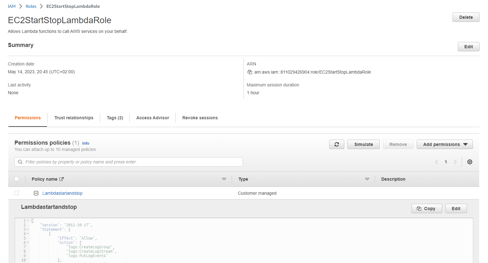
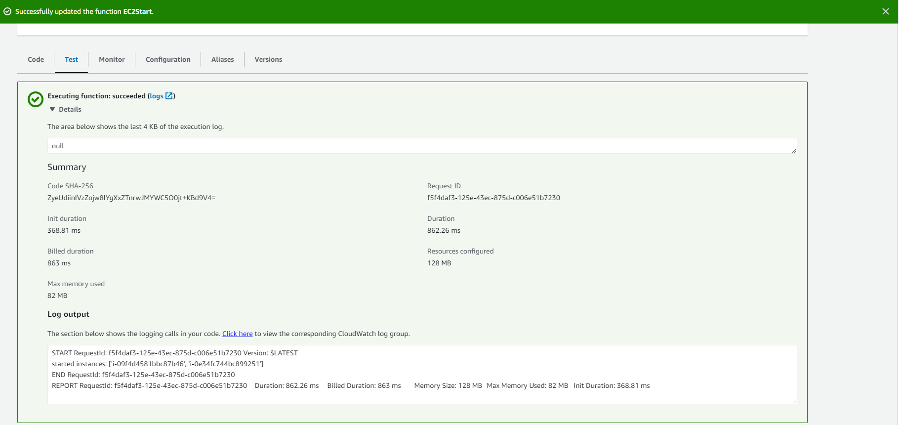
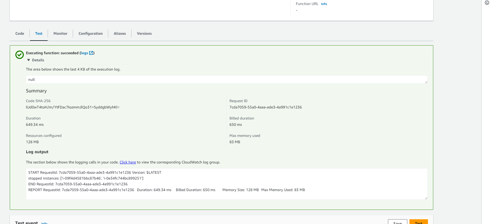
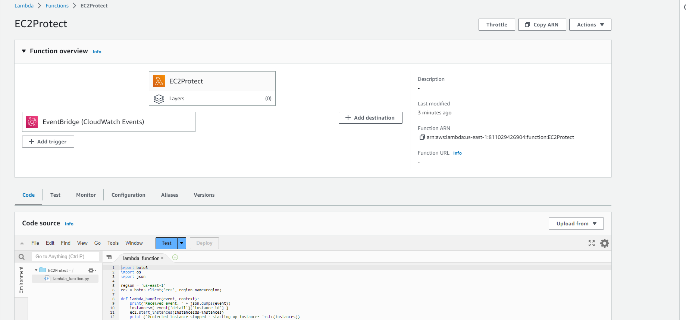
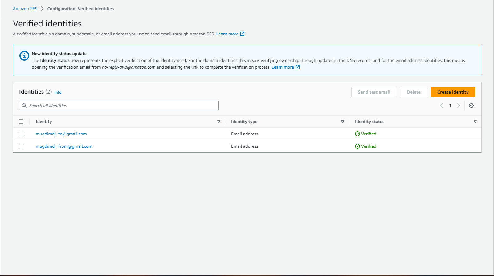
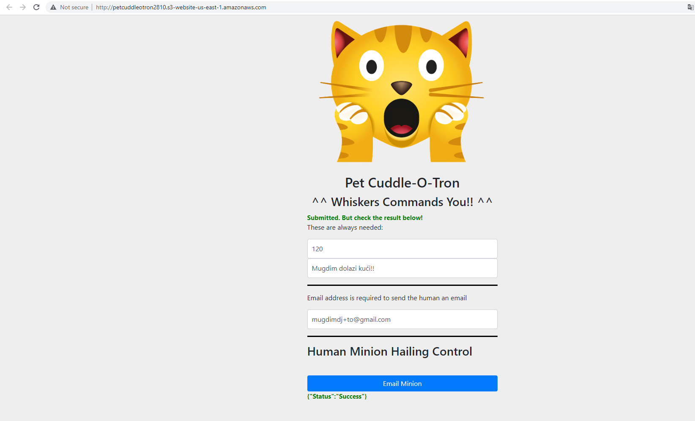

# TASK-10: Serverless and Application Services     
### Week 12     

### U nastavku su moje zabilješke iz lekcije.  

### ARCHITECTURE DEEP DIVE  

**Monolitna arhitektura** je kao blackbox koja se sastoji od vise slojeva uzajamno povezanih, 
sto znaci da pad jednog sloja vodi padu svih, ne mozemo skalirati samo jedan sloj, nego sve 
zajedno i slicno. Svi slojevi moraju biti pokrenuti sto iziskuje vece troskove. Skaliranje se 
ne moze vrsiti ponaosob nego je i skaliranje zajednicko, tj. nema vertikalnog skaliranja.  

**Slojevita arhitektura** je u prednosti u odnosu na monolitnu arhitekturu, gdje su 
prevazideni problemi skaliranja i pada nekog od slojeva. U ovoj arhitekturu moguce je koristi 
load balancere za vecu dostupnost. Mana ove arhitekture je pokazana na primjeru kada se vrsi 
upload, da upload sloj mora da komunicira sa processing slojem.. Ukoliko dode do pada 
processing sloja, problem se javlja i na upload sloju. U ovom slucaju nije moguce skaliranje 
na nulu instanci..  

Slojevita arhitektura se poboljsala uvodenjem redova (queue), prilikom cega se razdvajaju 
slojevi. Skaliranje slojeva se vrsi na osnovu duzine reda cekanja, prilikom cega sloj dodaje 
job-ove u red cekanja, a sljedeci sloj cita i izvrsava te job-ove. Uvodenjem queue skaliranje 
moze da bude od 0 do beskonacno.

### AWS LAMBDA  
Lambda je servis koji je poznat kao *Function as a Service (FaaS)*. Za Lambdu moramo 
definisati runtime, tj. okruzenje u kojem ce se izvrsiti. (npr. Python 3.9). One su 
stateless, tj. bez stanja i pokrecu se na zahtjev. Direktno kontrolisemo RAM (128 - 10240 
MB), ali CPU se indirektno skalira prema RAM-u (1769 MB -> 1vCPU). Ovaj servis placamo samo 
za ono vrijeme od pokretanja do kraja izvrsavanja funkcije. Maksimalno izvrsavanje je 15 
minuta. Kada izaberemo runtime, nema kasnije promjene.   
Lambda može da ima dva načina rada kada je u pitanju networking: *public* (defaultni odabir) 
i *VPC*. Sa public modom dobijamo najbolje performanse od lambde, a sa VPC modom lambdu 
posmatramo kao i sve druge resurse, moramo da joj dozvolimo permisije.  

Lambda funkciju mozemo pozvati na 3 razlicita nacina: **Sycnhronous, Asynchronous i Event 
Source mappings**.  
Razlikujemo Cold i Warm start. Cold start se odnosi na prvo pozivanje nakon duze 
neaktivnosti, pri cemo je AWS-u potrebno vise vremena za alociranje resursa i pokretanje same 
funkcije (cca 100ms). Warm start se odnosi na neposredno pozivanje nakon sto je prethodno 
pokretanje zavrsilo(cca 1-2ms). Ukoliko trebamo 10 poziva lambde odjednom, da bi izbjegli 
cold start koristimo provisioned concurrency.  

### CloudWatch Events and EventBridge  
**CloudWatch Events** vrsi monitoring u realnom vremenu dogadaja na AWS-u. Ti dogadaji mogu 
biti pozivanje Lambda funkcije, start/stop EC2.  
**EventBridge** je serverless servis za monitoring uz mogucnost upravljanja 
servisima/aplikacijama trecih strana.  

### Automated EC2 Control using Lambda and Events - DEMO  
U nastavku su slike kao dokaz izvrsenog demo zadatka iz lekcije.  

  

### Serverless Architecture  

U ovom slucaju cloud provider je odgovoran za izvrsavanje koda, kojem dodjeljuje resurse. 
Placamo samo resurse koji se iskoriste za pokretanje tog koda. Kod se obicno nalazi unutar 
stateless kontejnera koji se pokrecu na zahtjev (HTTP, database event, monitoring alert, file 
uploads, and similar).

### Simple Notification Service - SNS  

SNS je public servis, koji nam koristi za slanje i primanje poruka cija velicina ne prelazi 
256kB. SNS Topics je bazni entitet koji nam sluzi za permisije i konfiguraciju. **Publisher** 
salje poruke na TOPIC  (koji ima svoje pretplatnike (subscribers), koji primaju te poruke). 
**Subscribers** primaju te poruke.  Pretplatnici mogu biti: HTTP, Email, SQS, SMS, lambda...  

## Step Functions  

U ovom slucaju imamo stanja. Sa Step Functions mozemo kreirati Step Machines, koji imaju 
workflows kao **Start -> States -> END**. Razlikujemo dva tipa:  
- *Standard* koji je defaultni i cije trajanje izvrsavanja traje max 1 godinu.  
- *Express* koristi se za vece potrebe za resursima (streaming, app backend i slicno)  

Moze ih startati API GW, IOT pravila, EventBridge, Lambda...
Razlikujemo više stanja: *Suceed&Fail, Wait, Choice, Parallel, Map, Task(lambda, batch, 
DynamoDB, ECS, SNS, SQS, Glue...)*  

### API Gateway   

Putem ovog servisa aplikacije komuniciraju jedna sa drugom. API GW se ponaša kao Endpoint za 
aplikacije koje komuniciraju sa servisima. API GW je javni servis.
Razlikujemo više vrsta API-ja: HTTP, REST, WEBSOCKET.  
API GW Cache se koristi da se smanji broj zahtjeva prema backendu, cime se poboljsavaju 
performanse.  

### Build a Serverless App - Pet-Cuddle-o-Tron - DEMO  
U nastavku su slike kao dokaz izvrsenog demo zadatka iz lekcije.  
  
  

### Simple Queue Service  

SQS je public servis, koji nam omogućuje upravljanje redovima poruka. RAzlikuju se dva tipa 
redova, Standard (bar jednom) i FIFO (samo jednom). Maksimalna velicina poruke je 256 KB.
Za FIFO postoji opcija Batchinga što podrazumijeva da se u jednoj transakciji salje 10 
poruka.  
Sa SQS Delay Queues mozemo odgoditi dostavljanje poruke. Poruke mogu biti nevidljive u redu 
za vrijeme koje smo stavili.  

