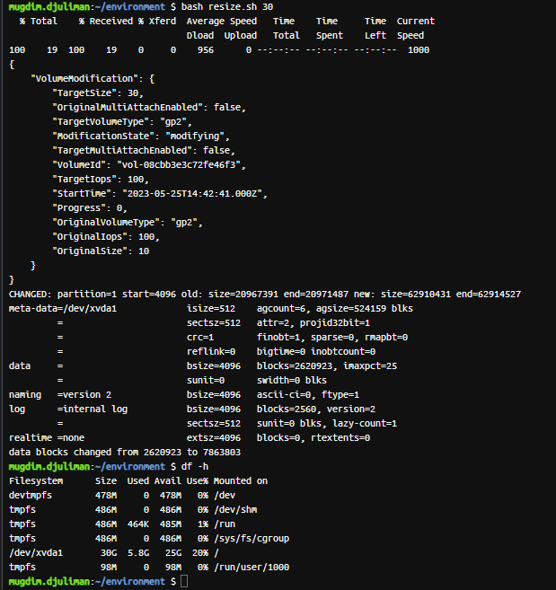
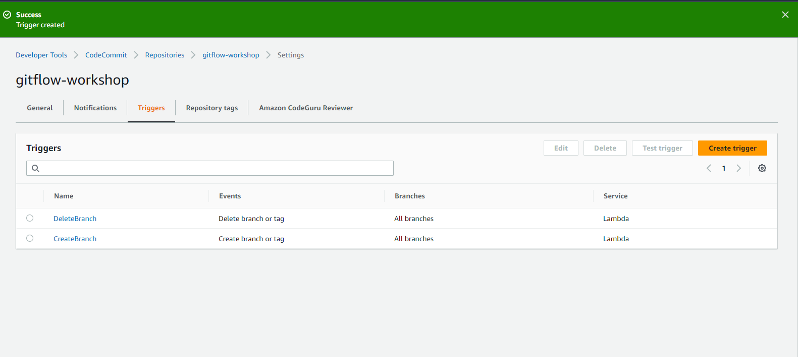

# TASK-11: AWS Tools GitFlow Workshop  
## Week 13  
Za ovaj task bilo je potrebno pratiti workshop sa 
[linka](https://catalog.us-east-1.prod.workshops.aws/workshops/484a7839-1887-43e8-a541-a8c014cd5b18/en-US/introduction). 
U nastavku ovog dokumenta su prikazani screenshot-ovi izvršenih demo/dijelova taska. 
Komentare sam stavio tamo gdje mi se razlikovalo u odnosu na workshop i gdje sam se susreo sa 
problemom.  

## Access AWS Cloud9 IDE  
 
Nakon kreiranja Cloud9 environmenta prosirio sam storage.  

  

 

## Initial Setup  

Podesio sam github kofiguraciju i instalirao gitflow.  
 
  

  

## AWS Cloudformation  
### Master Branch  
Podesavanje infrastrukture i aplikacije.  

  

  
  
  
  

Nakon ovog koraka izmijenio sam unutar file envcreate.yaml verziju Amazon Linux-a u 
SolutionStackName: "64bit Amazon Linux 2 v5.8.1 running Node.js 16".
Potrebno je bilo dodati i novi IAM rolu pod nazivom *aws-elasticbeanstalk-ec2-role* da EC2 
instance imaju permisije nad elasticbeanstalk.

  
  
  
  
  

### AWS Lambda  
Prije kreiranja Lambdi unutar S3 bucketa kreiranog kroz stack podesio sam defaultnu 
enkripciju kao na slici ispod.  
  
Kopirao sam ARN ključa i napravio dokument .elasticbeanstalk, kojeg sam stavio u zip i 
upload-ovao na S3 bucket. File lambda/lambda-create.yaml sam izmijenio da sam naziv S3 
bucketa stavio naziv svog S3 bucketa i S3Key naziv uploadovanog kljuca.U istom file sam 
izmijenio naziv policya za usera. Ovaj file je dostupan 
unutar foldera all-files-and-dirs-used-for-this-task.  

#### AWS CodeCommit Trigger
  
  

### Develop Branch
  
  

### Feature Branch  
 
  
  
  

