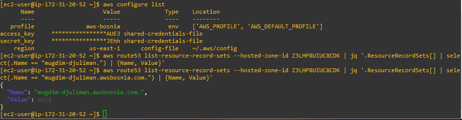
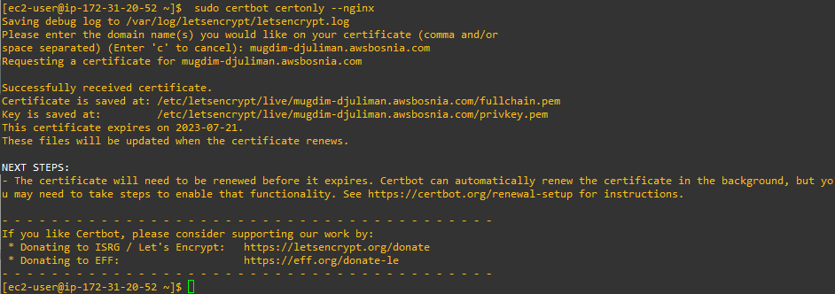
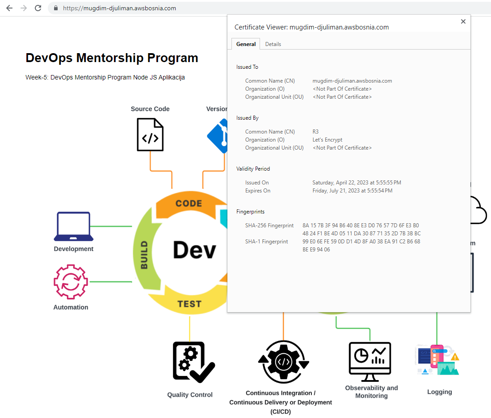
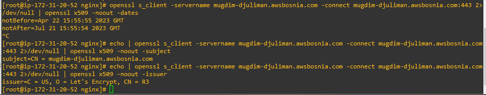
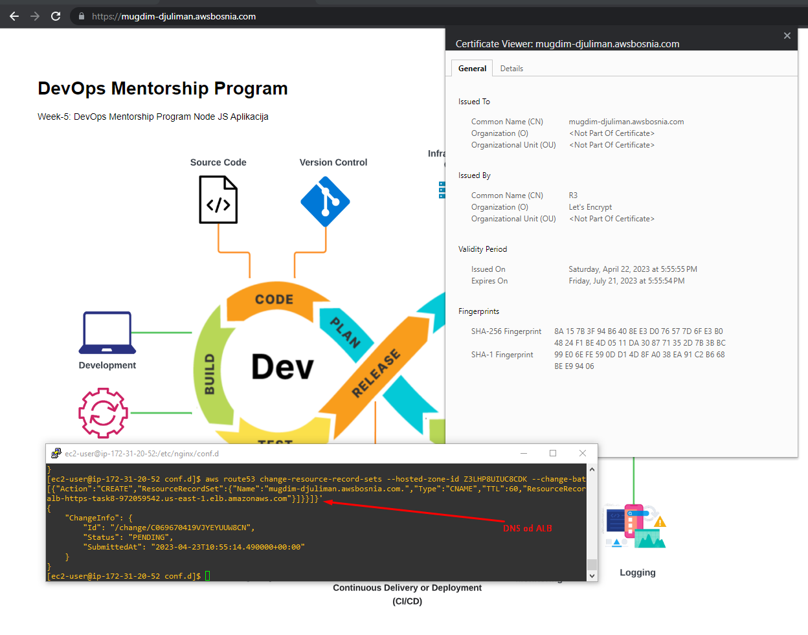
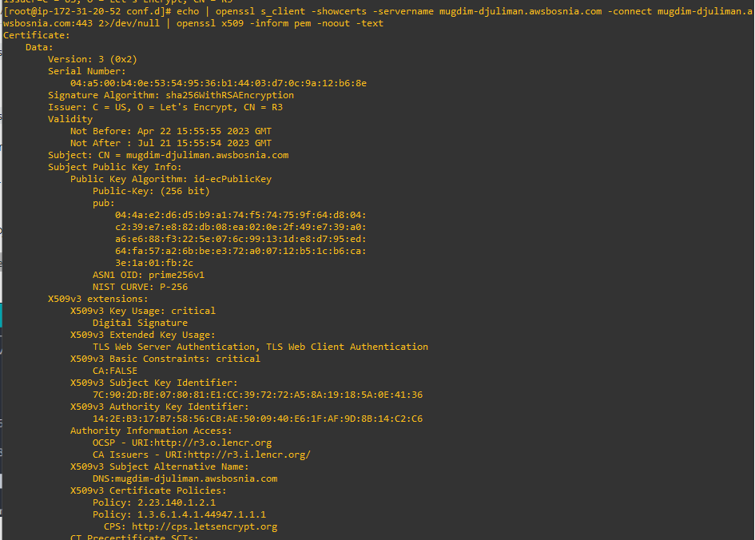
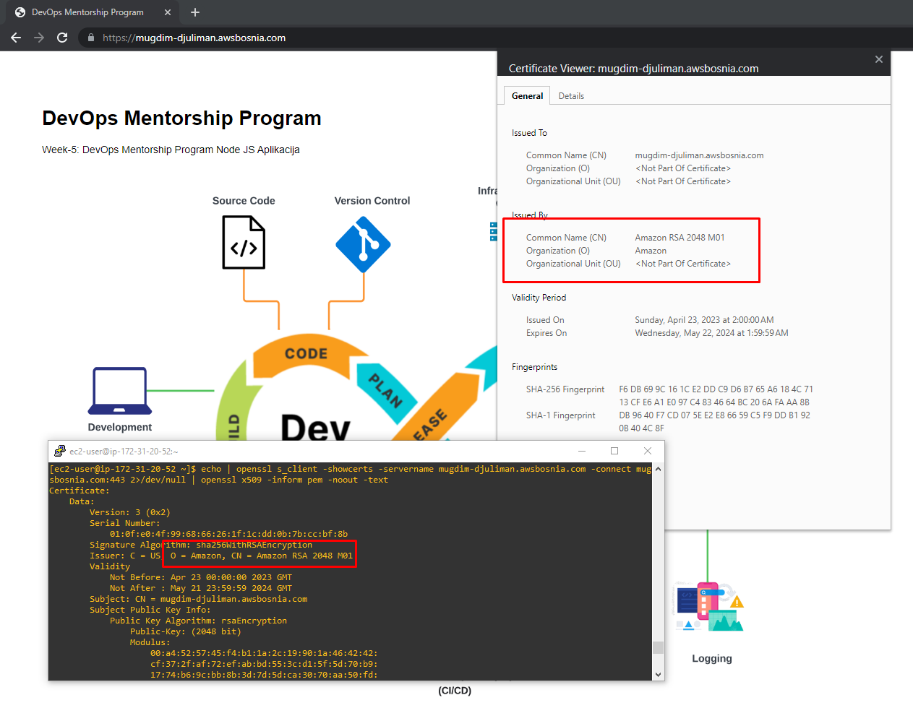
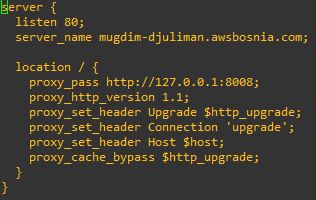

# TASK-8: Implement SSL Let's Encrypt, migrate to AWS SSM    
### Week 9  

### U nastavku su slike i kratka objašnjenja po tačkama u opisu task-a.

Koristeći komandu aws configure, unio sam kredencijale, te kreirao DNS record komandom sa slike ispod.  
  

Zahtjeve na domenu mugdim-djuliman.awsbosnia.com sam uputio na javnu ip adresu komandom:
```
aws route53 change-resource-record-sets --hosted-zone-id Z3LHP8UIUC8CDK --change-batch '{"Changes":[{"Action":"DELETE","ResourceRecordSet":{"Name":"mugdim-djuliman.awsbosnia.com.","Type":"A","TTL":60,"ResourceRecords":[{"Value":"54.226.59.97"}]}}]}'  
```

U nastavku slike kao verifikacija SSL certifikata kreiranog preko Let's Encrypt  

  

  

Autorenewal certifikata sam definisao putem crontab-a i skripte sa sljedećeg linka [CertBot](https://eff-certbot.readthedocs.io/en/stable/using.html#setting-up-automated-renewal)  

Nakon toga sam provjerio certifikat sa openssl komandama na slici u nastavku:  
  

### U nastavku je kreiranje ALB i dodavanje importovanog i kreiranog certifikata u ALB  
Certifikat sam importovao u ACM i nakon toga ga dodao u listener na ALB. Zahtjeve na moju domenu sam uputio na DNS name od ALB.  

Na slici ispod se vidi otvoren page u browseru i otvoren certifikat.
  

Sa openssl sam provjerio certifikat i kao što se može vidjeti to je isti certifikat kao i prethodno.  
  

Kreirao sam novi certifikat preko ACM od Amazona i editovao sam listener. Na slici ispod se vidi novi certifikat.  
  

### Ovim je TASK-8 završen, listenere koje sam dodao u ALB uvijek upućuju na https.

U nastavku je slika nginx conf file za ALB.  

  


 

