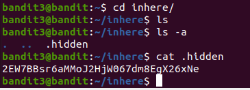

# Linux commands
### Week 2

#### Create new directory and new branch
git chechkout main  
git chechkout -b week-2-bandit-labs  
mkdir week-2  
vi bash-notes.md  

#### LEVEL 0

The goal of this level is for you to log into the game using SSH. The host to which you need to connect is bandit.labs.overthewire.org, on port 2219.The username is bandit0 and the password is bandit0.Once logged in, go to the Level 1 page to find out how to beat Level 1.  

There is picture as a confirmation of successfully completed level 0  
  

I used commands below:  
```
$ ssh -p 2220 bandit0@bandit.labs.overthewire.org  -#remote pristup serveru putem ssh po portu 2220  
$ cat readme  -#komanda za ispis sadržaja dokumenta  
```

#### LEVEL 1  

The password for the next level is stored in a file called - located in the home directory.  

There is picture as a confirmation of successfully completed level 1  
  

I used commands below:  
```
$ ssh -p 2220 bandit1@bandit.labs.overthewire.org  
$ cat < - -# znak "<" koristimo za ispis dokumenata koji počinju sa "-"    
```

#### LEVEL 2  

The password for the next level is stored in a file called spaces in this filename located in the home directory  

There is picture as a confirmation of successfully completed level 0  
  

I used commands below:  
```
$ ssh -p 2220 bandit0@bandit.labs.overthewire.org  
$ cat spaces\ in\ this\ filename  
```

#### LEVEL 3  

The password for the next level is stored in a hidden file in the inhere directory.  

There is picture as a confirmation of successfully completed level 3    
  

I used commands below:  
```
$ ssh -p 2220 bandit3@bandit.labs.overthewire.org  
$ cd inhere/  -#ulazak u folder  
$ ls -la  -#izlistavanje svih files unutar foldera  
$ cat .hidden  
```

#### LEVEL 4  

The password for the next level is stored in the only human-readable file in the inhere directory.  

There is picture as a confirmation of successfully completed level 4    
  

I used commands below:  
```
$ ssh -p 2220 bandit4@bandit.labs.overthewire.org  
$ file ./inhere/*  -#komanda koja ispisuje kakav je koji file unutar foldera  
$ cat inhere/.file07  
```

#### LEVEL 5  

The password for the next level is stored in a file somewhere under the inhere directory and has all of the following properties:  

human-readable  
1033 bytes in size  
not executable  

There is picture as a confirmation of successfully completed level 5  
  

I used commands below:  
```
$ ssh -p 2220 bandit5@bandit.labs.overthewire.org  
$ find ./inhere/* -size 1033c  -# unutar foldera inhere traži file veličine 1033 bajta  
$ cat inhere/maybehere07/.file2  
```

#### LEVEL 6  

The password for the next level is stored somewhere on the server and has all of the following properties:  

owned by user bandit7  
owned by group bandit6  
33 bytes in size  

There is picture as a confirmation of successfully completed level 6  
  

I used commands below:  
```
$ ssh -p 2220 bandit6@bandit.labs.overthewire.org  
$ find / -user bandit 7 -group bandit6 -size 33c  -#dodaci komandi zbog zahtjeva iz postavke zadatka  
$ cat /var/lib/dpkg/info/bandit7.password  
```

#### LEVEL 7  

The password for the next level is stored in the file data.txt next to the word millionth.  

There is picture as a confirmation of successfully completed level 7  
  

I used commands below:  
```
$ ssh -p 2220 bandit7@bandit.labs.overthewire.org  
$ cat data.txt | grep millionth  -#ispisujemo samo liniju u kojoj se spominje rijec millionth  
```

#### LEVEL 8 

The password for the next level is stored in the file data.txt and is the only line of text that occurs only once.  

There is picture as a confirmation of successfully completed level 8  
  

I used commands below:  
```
$ ssh -p 2220 bandit8@bandit.labs.overthewire.org  
$ sort data.txt | uniq -u  -#sortiramo pa ispisujemo samo liniju koja se jednom spominje u data.txt  
```

#### LEVEL 9  

The password for the next level is stored in the file data.txt in one of the few human-readable strings, preceded by several ‘=’ characters.  

There is picture as a confirmation of successfully completed level 9  
  

I used commands below:    
```
$ ssh -p 2220 bandit9@bandit.labs.overthewire.org  
$ strings data.txt | grep '===' -#ispisuje niz karaktera koji se nalaze u file-u uz ponavljanja niza jednakosti  
```

#### LEVEL 10

The password for the next level is stored in the file data.txt, which contains base64 encoded data  

There is picture as a confirmation of successfully completed level 10  
  

I used commands below:
```
$ ssh -p 2220 bandit10@bandit.labs.overthewire.org  
$ base64 -d data.txt  -#komanda base64 kodira/dekodira podatke i ispisuje  
```

