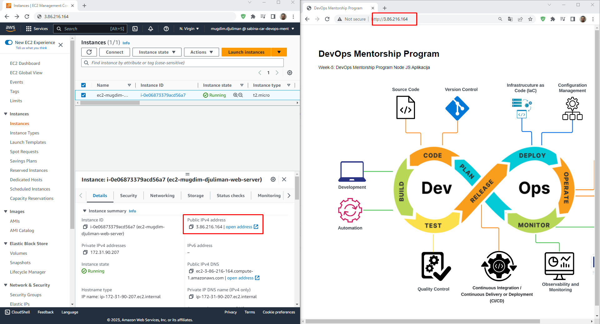
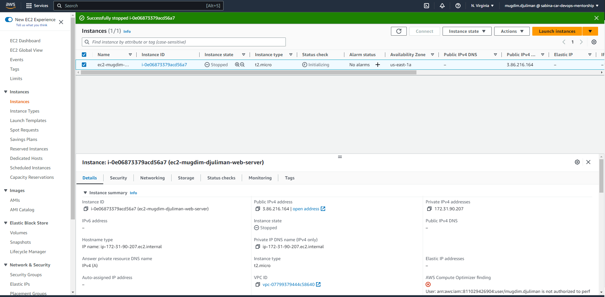
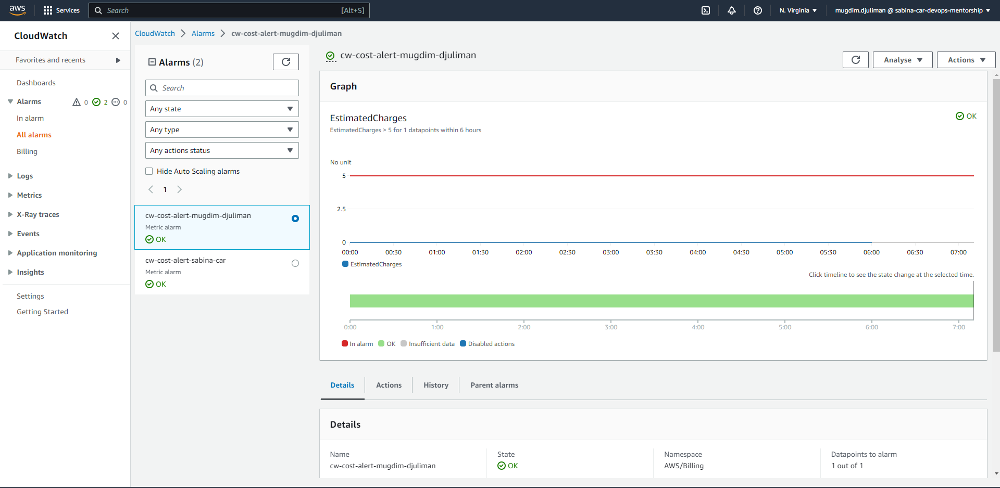

# TASK-6: Create an EC2 instance and deploy simple nodejs app  
### Week 7  

#### Browser gdje se vidi da ste pristupili aplikaciji koja se nalazi na EC2 instanci  

There is picture as a confirmation of successfully completed task  
  

#### EC2 dashboard gdje se vidi EC2 instanca u statusu stopped  

There is picture as a confirmation of successfully completed task  
  

#### CloudWatch Alarm koji ste kreirali za troskove  

There is picture as a confirmation of successfully completed task  
  
