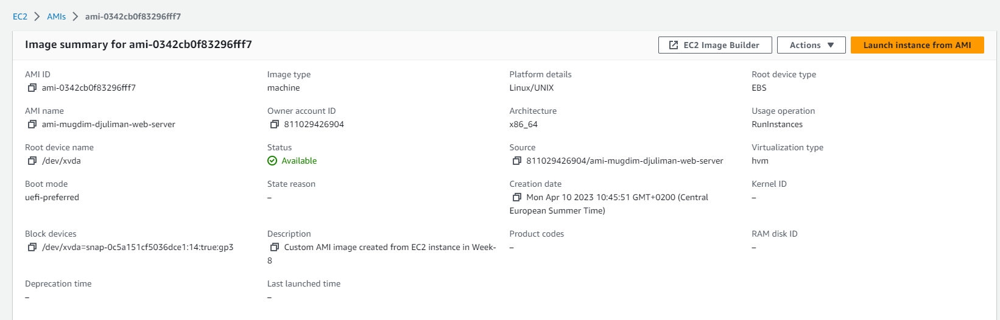
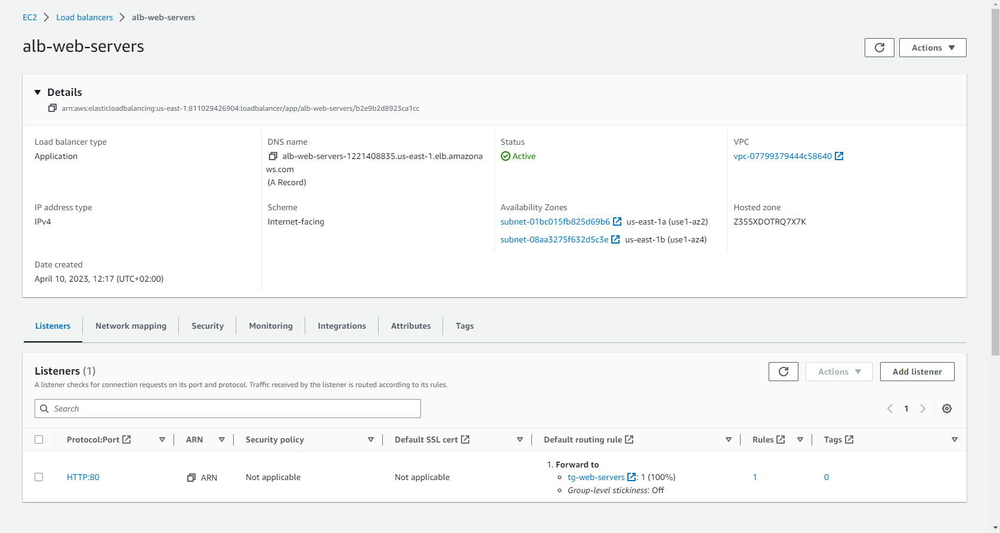
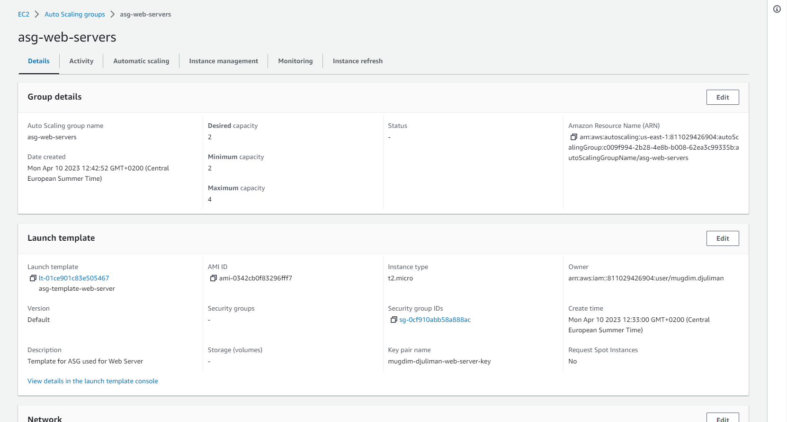
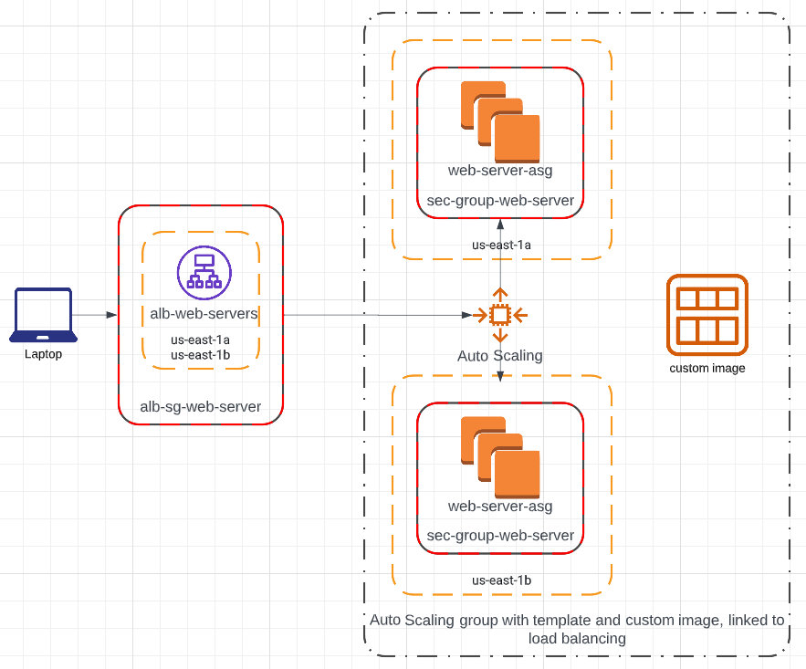
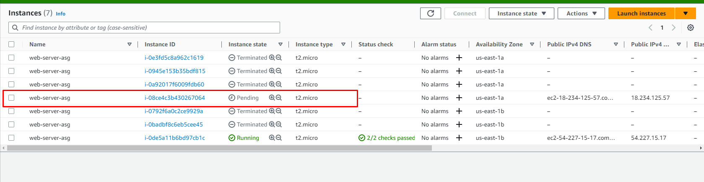
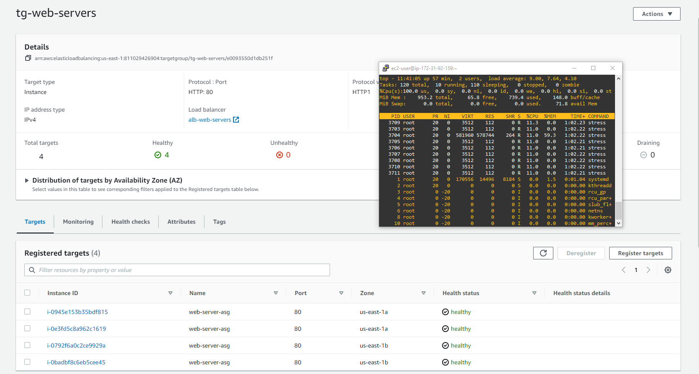

# TASK-7: Autoscaling Group and Load Balancer  
### Week 8    

#### Link na moj DNS record:  
http://alb-web-servers-1221408835.us-east-1.elb.amazonaws.com/  

#### Kreirajte AMI image od instance ec2-ime-prezime-web-server, AMI image nazovite ami-ime-prezime-web-server  
  

#### Kreirajte Application Load Balancer pod nazivom alb-web-servers koji ce da bude povezan sa Target Group tg-web-servers  
  

#### Kreirajte Auto Scaling group sa MIN 2 i MAX 4 instance. Tip instance koji cete koristiti unutar ASG je t2.micro ili t3.micro gdje cete koristiti alb-web-servers Load Balancer  
  

#### Voditite racuna da security grups koje budete koristili nakon sto zavrsite sa zadatakom dozvoljavaju namanje potrebne otvorene portove  

Stavio sam da security grupa za LB ima samo HTTP inbound port otvoren, a security grupa za EC2 instance ponaosob ima HTTP prema sec grupi za LB, te port 22 da bih mogao pristupit zbog CPU stres testa.  

#### Kreirajte free account na draw.io ili lucidchart.com stranicama i napravite dijagram infrastrukture iz ovog onako kako je vi vidite/razumijete.  
  

#### Pokusajte simulirati visoku dostupnost vase aplikacije na nacin da terminirate instance.  
Kada su bile aktivne samo dvije instance jednu sam terminirao. Nakon toga sam pratio stanje instance u dashboardu. Na slici ispod je trenutak kada se pali nova EC2 instanca.  
    

#### Pokusajte simulirati CPU load  
Na slici ispod je kad su upaljene 4 EC2 instance, jer se CPU podigao na 100%.  
    
